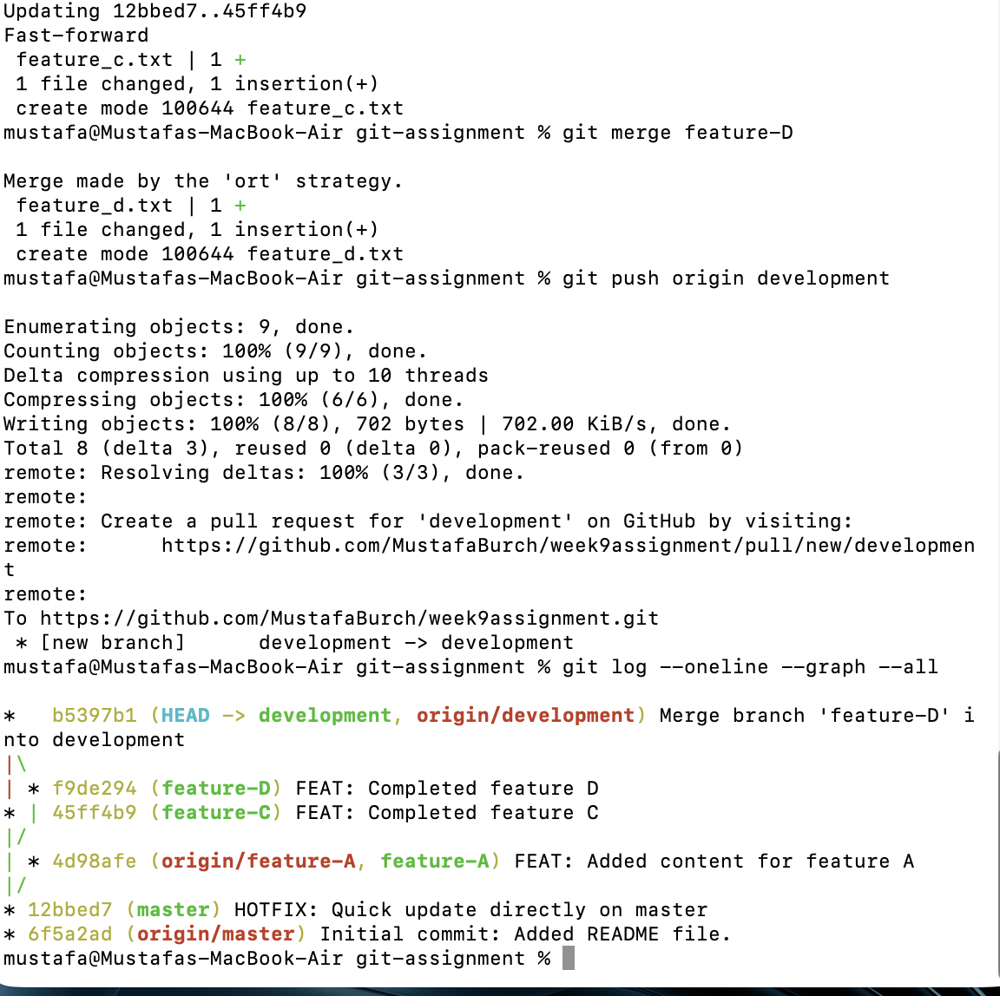

Git Version Control Practical Assignment

This repository contains the complete solution for the Git Version Control Practical Assignment. All required Git operations were performed locally and documented with screenshots, as requested.

Commands Demonstrated

git init
git add README.md
git commit -m "Initial commit"
git log --oneline
git remote add origin <repo-url>
git remote -v
git push -u origin master
git checkout -b feature-A
Updated README and committed changes
git checkout master
HOTFIX commit
git rebase master → conflict
Resolving conflict manually
git add README.md
git rebase --continue
git push origin feature-A --force
git checkout -b development
git checkout -b feature-C → new file + commit
git checkout development
git checkout -b feature-D → new file + commit
Merge feature-C into development
Merge feature-D into development
git push origin development
Final graph:
git log --oneline --graph --all

## screenshots
### Phase 1
## Screenshots

### Screenshot 1

### Screenshot 2

### Screenshot 3

### Screenshot 4

### Screenshot 5

### Screenshot 6

